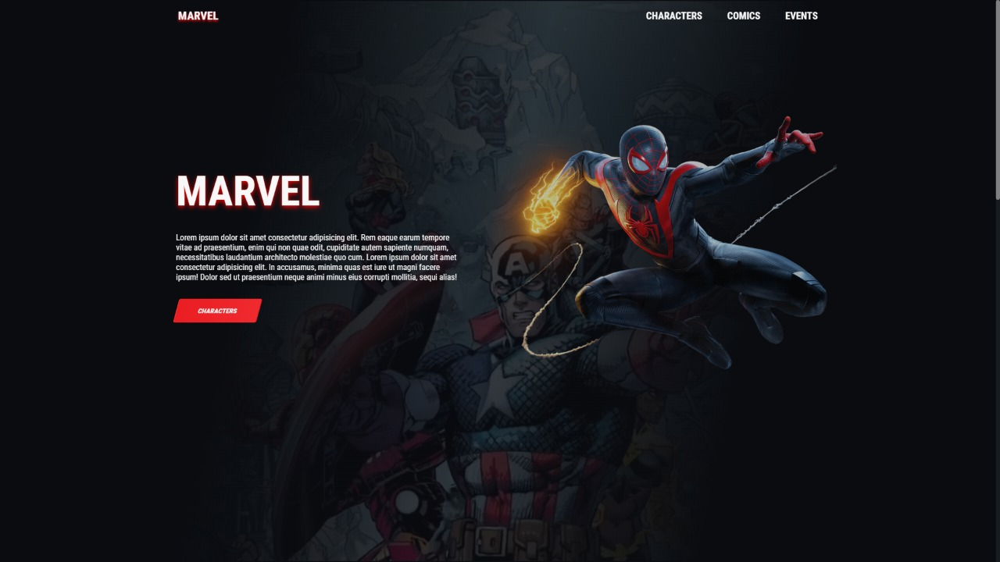
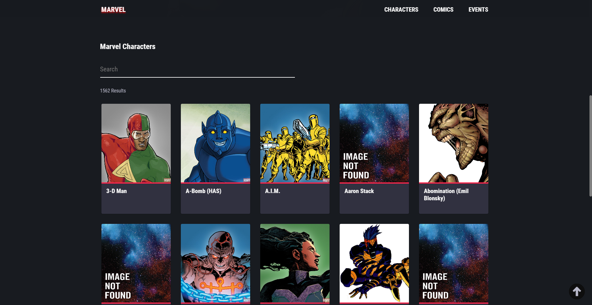
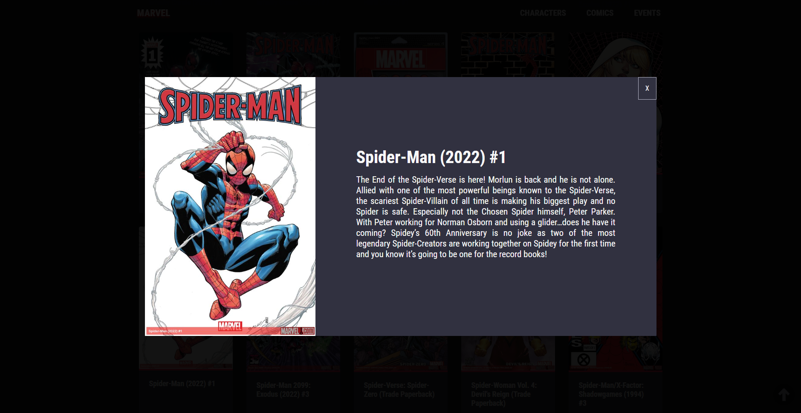

<h1 align="center">
    Apresentação do projeto
</h1>

<h3 align="center">
    
</h3>

<h3 align="center">
    
</h3>

<h3 align="center">
    
</h3>


<h3 align="center">
    <a href="https://marvelprojectdev.vercel.app">Acessar a demonstração</a>
<h3 >

---

## 🔖&nbsp; Sobre

O projeto foi desenvolvido com o intuito de praticar meus conhecimentos em Reactjs. <br/>
Foi ultilizada a api da  <a href="https://developer.marvel.com">Marvel</a> para listar os personagens, quadrinhos e eventos.

---


## 🚀 Tecnologias utilizadas

O projeto foi desenvolvido utilizando as seguintes tecnologias

- [ReactJS](https://reactjs.org)
- [React Router](https://v5.reactrouter.com/web/guides/quick-start)

---

## 🗂 Como baixar o projeto

```bash

    # Clonar o repositório
    $ git https://github.com/DevRafael-GL/marvel-app.git

    # Entrar no diretório
    $ cd marvel-app

    # Instalar as dependências
    $ npm install

    # Iniciar o projeto
    $ npm run start
```

---

Desenvolvido 💜 por Rafael Gonçalves Lima
